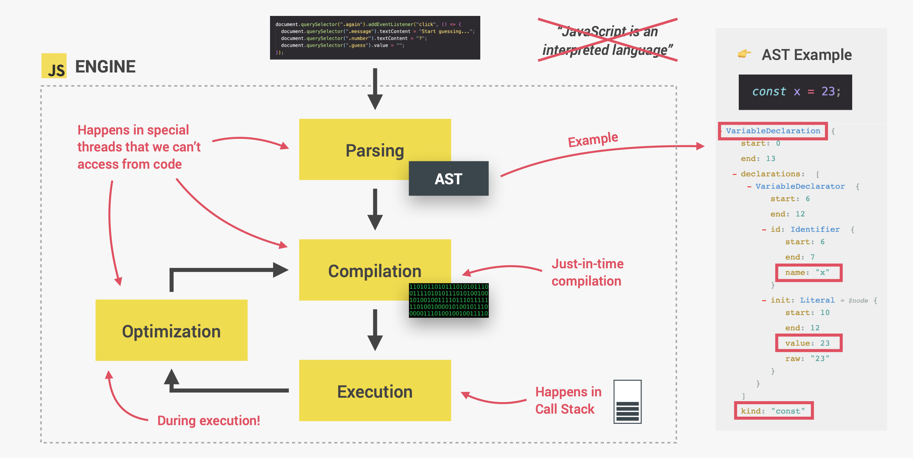

## JavaScript Behind The Scenes

### Deconstructing JS Features

1. High Level

    - Developer does not have to worry about low level things such as memory management etc.
    - Everything taken care by language.

2. Garbage Collected

    - Cleaning unused objects from memory.
    - We dont have to explicitly clean.

3. Interpreted or Just in time compiled

    -

4. Multi-paradigm

    - An approach and mindset of structuring code, which will direct your coding style and technique
        - Procedural Programming.
        - Object Oriented Programming.
        - Functional Programming.

5. Prototype-based object oriented

6. First class functions

    - In language with first-class functions, functions are simply treated as variables.
    - We can pass then into other functions, and return them from functions.

7. Dynamic

    - Dynamically typed.
    - No data type definitions.
    - Type identified at runtime.
    - Data type of variable is automatically changed upon reassignment with other type of data.

8. Single threaded

9. Non blocking event loop

## JavaScript Engine

### JavaScript engine consist of two main components

1. Call Stack
    - Where our code is executed
    - It contains execution context
2. Heap - Stores all the objects that our application needs

    

### Computer Science SideNote: Compilation Vs. Interpretation

-   Compilation : Entire code is converted into machine code at once, and written to a binary file that can be executed by a computer.

    

-   Interpretation: Interpreter runs through the source code and execute it line by line

    

-   Just-In-Time Compilation: Entire code is converted into a machine code at once and then executed immediately.

    

### Process

1. As a piece of javascript code enters the engine, the first step is to parse the code.
2. During the parsing process, the code is parsed to the data structure called AST(Abstract Syntax Tree), This step also check for syntax errors.

Example

```
const x = 23;

AST

VariableDeclaration: {
    start: 0
    end: 13
    - declaration: [
        - VariableDeclarator {
            start: 6
            end: 12
            - id: Identifier {
                start: 6
                end: 7
                name: "x"
            }
            - init: Literal = #node {
                start: 10
                end: 12
                value: 23
                raw: "23"
            }
        }
    ]
    kind: "const"
}
```

3. The next step is compilation, it takes generated AST and compiles it into machine code.
4. This machine code then gets executed right away.
5. Finish here ? NO !!
6. Modern JavaScript at first generates very unoptimized version of machine code at step 3, just so that it can start execute it as fast as possible.
7. Then in background this code is being optimized and recompiled during already running program execution, without stopping execution.
8. This process makes modern js so fast.

    

### Runtime in Browser

#### Runtime contains

1. Engine
2. Web API's : Not part of JavaScript language but functionalities provided by browser to the engine
3. Callback Queue : This is a data structures which contains all the callback functions that are ready to be executed.
4. Event Loop : As the event happens callback queue picks the function from callback queue and put it into the call stack for execution.
